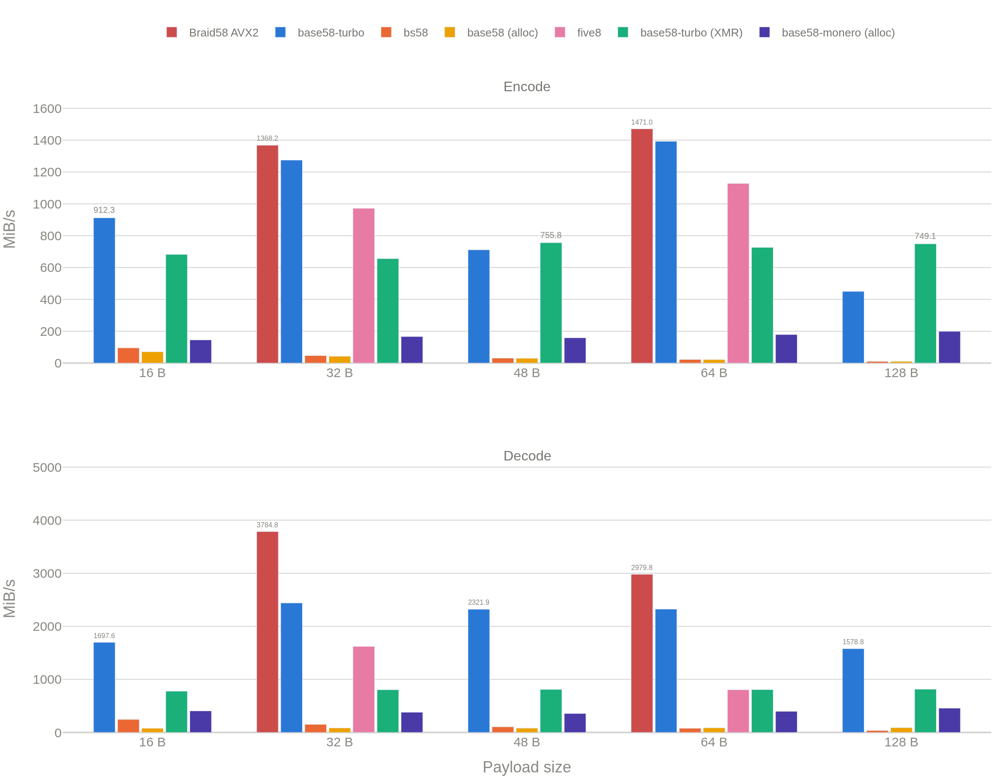
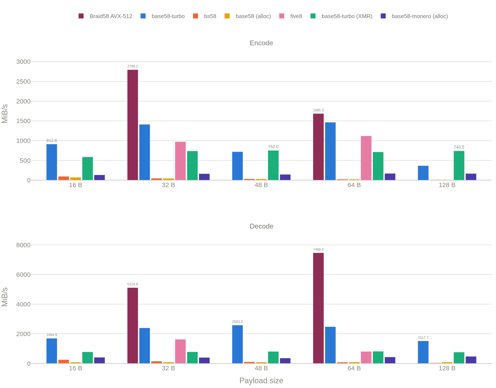

# Braid58

Bitcoin Base58 codec for fixed 32-byte and 64-byte values.

The name comes from the radix-conversion schedule.
For radix-`2^26` input limbs `x_i`, each output-cell accumulator is `y_j = sum_i(x_i M_ij)`.
The independent `y_j` chains are evaluated in parallel, then joined by carry propagation in radix `B`, where `B = 58^6` for AVX-512 Encode32 and `B = 58^5` for AVX2 and Encode64.

## Base58 Turbo benchmark

Measured with [Base58 Turbo](https://github.com/hacer-bark/base58-turbo)'s benchmark at `18c8f94eadfa5643dfd7e31b02250d3bf184fa68`.
Each Braid58 backend and Turbo are measured in the same executable with identical inputs.
Outputs are verified before timing.

### Scalar

Turbo's `unsafe-simd` feature is disabled for this comparison. Both portable
paths target the x86-64 ISA baseline.

| Operation | Braid58 scalar | Base58 Turbo scalar |
|---|---:|---:|
| Encode32 | 1.260 GiB/s | 1.292 GiB/s |
| Decode32 | 1.914 GiB/s | 1.812 GiB/s |
| Encode64 | 0.860 GiB/s | 0.763 GiB/s |
| Decode64 | 1.748 GiB/s | 1.664 GiB/s |

### AVX2



| Operation | Braid58 AVX2 | Base58 Turbo AVX2 |
|---|---:|---:|
| Encode32 | 1.3361 GiB/s | 1.2448 GiB/s |
| Decode32 | 3.6961 GiB/s | 2.3830 GiB/s |
| Encode64 | 1.4365 GiB/s | 1.3604 GiB/s |
| Decode64 | 2.9100 GiB/s | 2.2701 GiB/s |

### AVX-512

> **ISA comparison:** This table compares Braid58 AVX-512 with Base58 Turbo AVX2.
> Base58 Turbo has no AVX-512 backend.
> The AVX2 table measures both implementations at the same ISA level.



| Operation | Braid58 AVX-512 | Base58 Turbo AVX2 |
|---|---:|---:|
| Encode32 | 2.7307 GiB/s | 1.3784 GiB/s |
| Decode32 | 4.9969 GiB/s | 2.3406 GiB/s |
| Encode64 | 1.6458 GiB/s | 1.4307 GiB/s |
| Decode64 | 7.2930 GiB/s | 2.4205 GiB/s |

<p align="center"><sub>
AMD Ryzen Threadripper PRO 9995WX, CPU 31.
Braid58: GCC 16.2.1.
Base58 Turbo AVX2: Rust 1.96.0.
Encode throughput counts binary input bytes; decode throughput counts encoded input bytes.
</sub></p>

### Encode32 x3

The SIMD backends provide staged x2 and x3 encoders.
This benchmark calls `braid58_encode_32x3` and Base58 Turbo's public `encode_32_batch` through a C bridge.
Each call receives the same three full-width inputs, and output comparison precedes timing.
The AVX2 Braid58 and Turbo builds target the Haswell ISA floor.

| Braid target | Braid ticks/batch | Turbo ticks/batch | Braid throughput | Turbo throughput |
|---|---:|---:|---:|---:|
| AVX2 | 117.68 | 140.03 | 1.899 GiB/s | 1.596 GiB/s |
| AVX-512 | 66.98 | 144.94 | 3.337 GiB/s | 1.542 GiB/s |

On AVX2, Braid58 x3 uses 39.23 ticks per value, compared with 56.95 ticks for Braid58 single-value encoding and 46.68 ticks for Turbo x3.
The x3 kernel reduces per-value time by 31.1% and 16.0%, respectively.

Turbo has no fixed-64 batch entry point.
Against three sequential Turbo calls, AVX2 Encode64 x3 measures 1.798 GiB/s versus 1.602 GiB/s and reduces Braid58's single-value time per value by 20.4%.
The AVX-512 Encode64 x2/x3 entry points call the single-value kernel once per lane; they are not dedicated batch kernels.

> **ISA comparison:** The AVX-512 row compares Braid58 AVX-512 with Base58 Turbo AVX2.
> It does not isolate implementation performance at a common ISA level.

Exact commands and timing intervals are in [BENCHMARKS.md](BENCHMARKS.md).

## Properties

- Bitcoin alphabet only.
- Canonical leading-zero encoding.
- Exact decoded width: 32 or 64 bytes.
- No allocation.
- Fixed x2/x3 encoding APIs with dedicated SIMD schedules where listed.
- Decoder output is unchanged on failure.
- Compile-time scalar, AVX2, or AVX-512 selection.
- No CPUID checks or runtime dispatch.

## Algorithm comparison

| Implementation | Input scope | Conversion | SIMD selection |
|---|---|---|---|
| Braid58 | Fixed 32/64 bytes | Precomputed encode matrices and fixed-limb decode schedules | Compile time |
| Base58 Turbo | Variable length | Radix-`58^2` limbs with repeated normalization | Runtime |
| Firedancer bs58 | Fixed 32/64 bytes | Firedancer-specific limb and conversion schedule | Build configuration |

Braid58 uses separate AVX2 and AVX-512 matrix layouts.
No Turbo or Firedancer algorithm source is used.

## Rust API

The crate is `no_std` and has no runtime Rust dependencies.

```rust
let bytes = [42_u8; 32];
let text = braid58::encode_32(&bytes);
assert_eq!(braid58::decode_32(text.as_str())?, bytes);

let bytes = [7_u8; 64];
let text = braid58::encode_64(&bytes);
assert_eq!(braid58::decode_64(text.as_str())?, bytes);

let inputs = [[1_u8; 32], [2_u8; 32], [3_u8; 32]];
let encoded = braid58::encode_32x3(&inputs);
assert_eq!(encoded[1], braid58::encode_32(&inputs[1]));
# Ok::<(), braid58::DecodeError>(())
```

`Encoded32` and `Encoded64` implement `Display`, `Deref<Target = str>`, `AsRef<str>`, and `AsRef<[u8]>`.
`decode_32_into` and `decode_64_into` write to caller-provided arrays.
`encode_32x2`, `encode_32x3`, `encode_64x2`, and `encode_64x3` expose the fixed batch entry points.

```sh
cargo test
RUSTFLAGS="-C target-cpu=native" cargo test
```

Braid58 selects the backend from Cargo's compilation target.
Generic targets use the portable scalar implementation; `-C target-cpu=native` exposes the host CPU features and selects the fastest compatible backend.
The `avx2` and `avx512` Cargo features are explicit overrides for binaries that require those ISA levels.
Backend selection is compile-time and adds no runtime dispatch.

## C API

```c
#include <braid58.h>

uint8_t input[32] = {0};
uint8_t decoded[32];
char encoded[BRAID58_ENCODED_32_CAPACITY];

size_t length = braid58_encode_32(input, encoded);
int ok = braid58_decode_32(encoded, length, decoded);

uint8_t batch[3][32] = {{0}};
char batch_encoded[3][BRAID58_ENCODED_32_CAPACITY];
size_t batch_length[3];
braid58_encode_32x3(batch, batch_encoded, batch_length);
```

Exported symbols:

- `braid58_encode_32`
- `braid58_encode_32x2`
- `braid58_encode_32x3`
- `braid58_decode_32`
- `braid58_encode_64`
- `braid58_encode_64x2`
- `braid58_encode_64x3`
- `braid58_decode_64`

Build and install:

```sh
cmake -S . -B build/cmake \
  -DCMAKE_BUILD_TYPE=Release \
  -DBRAID58_TARGET=native
cmake --build build/cmake
ctest --test-dir build/cmake
cmake --install build/cmake --prefix /usr/local
```

CMake and pkg-config metadata are installed with the library.

```cmake
find_package(braid58 0.1 CONFIG REQUIRED)
target_link_libraries(app PRIVATE braid58::braid58)
```

```sh
cc app.c $(pkg-config --cflags --libs braid58)
```

Set `BUILD_SHARED_LIBS=ON` for a shared library.

## Targets

| Backend | Cargo | CMake | ISA |
|---|---|---|---|
| Scalar | Generic target | `scalar` | Portable C11 |
| AVX2 | AVX2 target feature or `avx2` | `avx2` | Cargo: AVX2; CMake: Haswell |
| AVX-512 | Required target features or `avx512` | `avx512` | AVX2, BMI1, MOVBE, AVX-512 F/DQ/BW/VL/IFMA/VBMI |
| Native | `-C target-cpu=native` | `native` | Highest backend supported by the compilation target |

`BRAID58_TARGET` defaults to `scalar`.
Cargo target detection uses `CARGO_CFG_TARGET_ARCH` and `CARGO_CFG_TARGET_FEATURE`, so cross-compilation follows the target rather than the build host.
SIMD backends require x86-64 and GCC or Clang and must not execute on CPUs missing the listed ISA.

Selected kernels:

| Target | Encode32 | Decode32 | Encode64 | Decode64 |
|---|---|---|---|---|
| Scalar | B5 matrix | B10 limbs | B5 matrix | B10 limbs |
| AVX2 | B5 single/x2/x3 | B4 | B5 single/x2/x3 | B4 |
| 9995WX AVX-512 | ZMM B6 single/x2/x3 | mixed ZMM B4 | ZMM B5 single | mixed ZMM/YMM B4 |

## Verification

```sh
make test
make test-optimized TEST_TARGET=native
make test-sanitize TEST_TARGET=native
make rust-test
make audit
make bench
```

The C tests cover differential encoding and decoding, all leading-zero prefix lengths, invalid alphabet bytes, overflow, canonicality, NULL arguments, and failure-atomic decode output.
`make audit` checks the AVX2 ISA boundary, selected AVX-512 instruction families, and the exported ABI.

Benchmark data and the pinned Base58 Turbo gate are documented in [BENCHMARKS.md](BENCHMARKS.md) and [docs/TURBO_GATE.md](docs/TURBO_GATE.md).

## Restrictions

- Inputs and outputs must not overlap.
- SIMD builds do not check CPU features.
- Execution is data-dependent and not constant-time.
- The implementation has not received an independent security audit.
- No project license is assigned; Cargo publishing is disabled.
